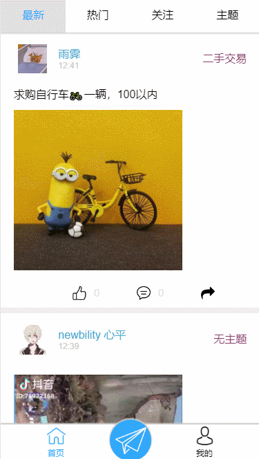

# 东北农业大学校友圈

> &#x1F393; [校友圈](https://neau-lib.xiaonei.io/feed/#/)

**试用项目首先要关注微信测试号** 

**项目预览地址：&#x1F449;** [https://neau-lib.xiaonei.io/feed/#/](https://neau-lib.xiaonei.io/feed/#/) 或 扫描二维码


&#x1F625;鉴于校园内同学之间信息沟通不方便，尤其在二手交易和失物招领等地方，同学没有一个交流的平台
&#x1F4A1;于是我借鉴像微博，即刻这样的信息流平台独立开发了属于东北农业大学信息交流平台-->校友圈
&#x1F4AA;基于Egg.js、七牛云、微信公众平台开发 、MongoDB编写了、数据后台及API接口，基于Vue.js、Vue Router以及Mint-UI对前端界面进行了设计编写

搭建出了如下所示的东农校友圈&#x1F308;：

> ### 1.二手交易信息


> ### 2.分享的有趣视频


> ### 3.评论及个人信息


> &#x26A0; Tips：还有很多其他的功能未能一一截成GIF动图

## 安装 / 开始开发

```bash
  # 安装依赖
  $ cd backend
  $ npm install

  # 启动开发模式
  $ npm run dev
```

> &#x26A0; Tips：应用将会运行在 [http://localhost:7001/](http://localhost:7001/)

## 使用cnpm或淘宝镜像安装

因部分资源下载缓慢，推荐使用淘宝镜像
```bash
npm --registry https://registry.npm.taobao.org install
```
或者使用cnpm安装
```bash
npm --registry https://registry.npm.taobao.org install cnpm -g
cnpm install
```

## 部署

```bash
  $ npm start
  $ npm stop
```

## 框架配置

```js
  // conig/plugin.js
    ...
    //插件配置
    exports.mongoose = {
    enable: true,
    package: 'egg-mongoose',
    };

    exports.qiniu2 = {
    enable: true,
    package: 'egg-qiniu2',
    };

    exports.redis = {
    enable: true,
    package: 'egg-redis',
    };

    exports.cors = {
    enable: true,
    package: 'egg-cors',
    };

    exports.io = {
    enable: true,
    package: 'egg-socket.io',
    };

    ...
```

## 通过WebSocket连接

因需要实时提醒用户收到的评论点赞，所以需要采用实时的方式推送给用户,经过查阅资料，第一版为了方便改写使用长轮询的方式来获得实时的效果，但其代码逻辑极其难以维护，而且不够美观，所以在第二版中采用了WebScoket这种全双工的通信方式，使用了Socket.io框架,Egg.js上有egg-socket.io这个插件可以使用

## 开发模式跨域解决方案

在开发过程中，由于采用了前后端分离开发的方法，使得后端（Egg.js - 7001端口）与前端（Vue.js - 8080端口）产生了跨域问题 &#x1F4A2;  
&#x1F4A1; 解决方案：使用egg.js中的插件Egg-cors;

> &#x26A0; Tips：在生产环境中，将已编译好的文件合并入后端系统中时不会出现跨域问题，因为前端请求路由与后端路由处于同一域名和端口下。此处的跨域问题仅出现在开发过程中(生产环境请注释掉这段代码)
 ```js
  //Feed/config/config.default.js
  config.cors = {
    credentials: true,
  }
 ```
## ToDos

  + 优化API风格，严格按照Restful风格进行编写
  + 添加单元测试代码

## 其他

  + &#x1F4CD; 如果您有任何好的建议或想法，欢迎在我的 Issue 中交流探讨
  + &#x1F4E7; 您也可以向我发送邮件以取得联系： 438376555@qq.com


> &#x26A0; Tips：查看后端项目点这里[前端项目](https://github.com/BFjacky/feed-web.git)
